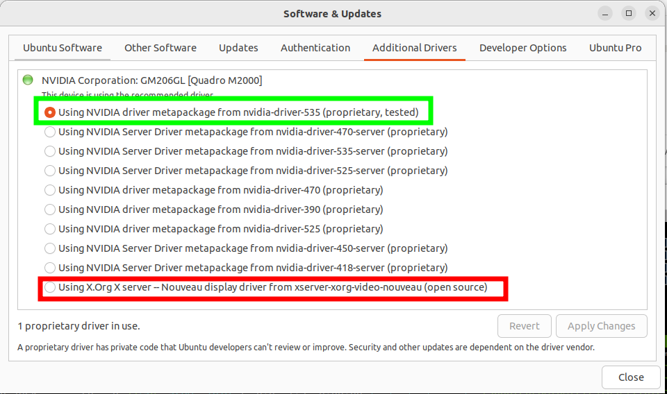

# ansible
Ansible play book for personal PC setup

## Pre-steps (pip)
Check if you have pip
```
python3 -m pip -V
```
If not then install pip with
```
sudo apt install python3-pip
```

Install ansible-core
```
python3 -m pip install --user ansible-core
```

Check install
```
$ ansible --version
ansible [core 2.17.14]
  config file = None
  configured module search path = ['/home/jack/.ansible/plugins/modules', '/usr/share/ansible/plugins/modules']
  ansible python module location = /home/jack/.local/lib/python3.10/site-packages/ansible
  ansible collection location = /home/jack/.ansible/collections:/usr/share/ansible/collections
  executable location = /home/jack/.local/bin/ansible
  python version = 3.10.12 (main, Aug 15 2025, 14:32:43) [GCC 11.4.0] (/usr/bin/python3)
  jinja version = 3.1.6
  libyaml = True
```

Now we can install any extra ansible collections that are required since we only installed the core to start with to keep the install light

```
ansible-galaxy collection install -r requirements.yml
```

## Run playbook

```
ansible-pull https://github.com/jack-scott/ansible.git
```

Or if you already have the files locally you can run. Note the -K means it will ask for the password when required.

```
ansible-playbook local.yml -K
```

If you just wish to run (or re-run a particular task) you can do that using the tags. Append one or more tags as follows
```
# Available tags: essential, convenient, keybindings, dockers, dirs, gui
ansible-playbook local.yml -K --tags docker,gui
```


## Troubleshooting a new setup

### Chrome tabs using 100% CPU

To verify this is the same cause bring up htop, press F4 to filter and then type `chrome --type=gpu` if you are seeing this process use 100% CPU without anything running in the browser then you can try changing your graphics driver.

Go to `Software and updates` and click on the additional drivers tab. Assuming you have Nvidia hardware, change from the default Nouveau driver to the recomended Nvidia.


Reboot system and test again.